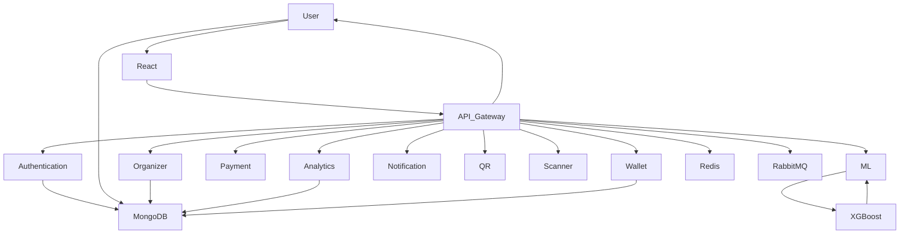

<div align="center">


<br>

<p align="center">

</p>

<br>

A production-ready **AI-powered Event Ticketing Platform** built using the **MERN Stack**, **Microservices**, **Machine Learning**, **Docker**, **Redis**, and **RabbitMQ** to intelligently optimize ticket prices in real time.

<p>

<a href="https://github.com/Souptik-Hazra/Dynamic-ticket-pricing">

</a>

<a href="https://github.com/Souptik-Hazra/Dynamic-ticket-pricing/network/members">

</a>

<a href="https://github.com/Souptik-Hazra/Dynamic-ticket-pricing/issues">

</a>

<a href="LICENSE">

</a>

</p>

---

# 📂 Project Structure

```text
Dynamic-ticket-pricing
│
├── microservices/
│   ├── api-gateway/
│   ├── authentication-service/
│   ├── user-service/
│   ├── organizer-service/
│   ├── analytics-service/
│   ├── payment-service/
│   ├── wallet-service/
│   ├── notification-service/
│   ├── websocket-service/
│   ├── qr-service/
│   ├── scanner-service/
│   └── shared/
│
├── ml-model/
├── src/
├── PlantUML/
├── postman/
├── production/
├── tests/
└── docker-compose.yml
```

---

# 🤖 Machine Learning

The pricing engine uses an **XGBoost Regression Model** to estimate optimal ticket prices using historical bookings, demand, venue capacity, and event-specific features.

### ML Service

- XGBoost Regression
- Flask REST API
- Gunicorn Production Server
- Joblib Model Serialization
- Dockerized Deployment

---

# 📡 Core Services

| Service | Responsibility |
|----------|----------------|
| API Gateway | Request routing |
| Authentication | JWT Authentication |
| User Service | User management |
| Organizer Service | Event management |
| Analytics Service | Reports & Insights |
| ML Service | Price Prediction |
| Redis | Distributed Cache |
| RabbitMQ | Asynchronous Messaging |
| MongoDB | Primary Database |

---

# 📸 Application Preview

> Replace these placeholders with the latest screenshots.

<p align="center">

</p>

<p align="center">


</p>

<p align="center">


</p>

---

# 🚀 Quick Start

### Clone Repository

```bash
git clone https://github.com/Souptik-Hazra/Dynamic-ticket-pricing.git

cd Dynamic-ticket-pricing
```

### Run with Docker

```bash
docker compose build

docker compose up
```

Application

```text
Frontend      http://localhost:5173
API Gateway   http://localhost:3001
ML Service    http://localhost:5000
MongoDB       localhost:27017
Redis         localhost:6379
```

---

# 🧪 Testing

Run backend tests

```bash
npm test
```

Verify ML service

```bash
python test_api.py
```

Import the Postman collection from the **postman/** directory to test all APIs.

---

# 🗺️ Roadmap

- ✅ Microservice Architecture
- ✅ JWT Authentication
- ✅ Dynamic Ticket Pricing
- ✅ Analytics Dashboard
- ✅ Redis Integration
- ✅ RabbitMQ Integration
- ✅ Docker Deployment
- ✅ Electron Desktop
- ⏳ Payment Gateway
- ⏳ Email Notifications
- ⏳ Kubernetes Deployment
- ⏳ CI/CD Pipeline

---

# 🤝 Contributing

Contributions are welcome.

```bash
Fork → Create Branch → Commit → Push → Pull Request
```

Please follow the existing project structure and coding standards.

---

# 📄 License

Licensed under the **MIT License**.

See the **LICENSE** file for more information.

---

<div align="center">

## ⭐ Support the Project

If you found this project helpful, consider giving it a **⭐ Star** on GitHub.

<br>


<br><br>

**Designed & Developed by Souptik Hazra**

*MCA @ VIT Vellore • AI • Machine Learning • Full Stack • Data Engineering*

<br>


</div>
<p>


</p>

</div>

---

# 📖 Overview

The **Dynamic Ticket Pricing System** is a modern event management platform that combines **Artificial Intelligence**, **Machine Learning**, and a **Microservice-based Architecture** to automatically adjust ticket prices according to demand, venue capacity, booking trends, event popularity, and other real-time factors.

Unlike traditional ticket booking systems that rely on fixed pricing, this platform continuously predicts optimal ticket prices using a trained **XGBoost Machine Learning model**, helping organizers maximize revenue while offering fair pricing to customers.

The project is designed with scalability and production-readiness in mind, featuring Dockerized services, distributed caching, asynchronous messaging, REST APIs, centralized logging, and a dedicated ML prediction service.

---

# ✨ Key Features

## 🎟️ Event Management

- Event creation and management
- Organizer dashboard
- Multiple ticket categories
- Ticket inventory management
- Booking management
- QR-based ticket validation

---

## 🤖 AI Powered Dynamic Pricing

- XGBoost Regression Model
- Demand-based ticket pricing
- Historical sales analysis
- Capacity-aware pricing
- Event popularity prediction
- Real-time price recommendations

---

## 📊 Analytics

- Revenue analytics
- Sales dashboard
- Ticket insights
- Price history
- Booking statistics
- Organizer reports

---

## 🔐 Security

- JWT Authentication
- Role-based Authorization
- Password Hashing
- Protected REST APIs
- Rate Limiting
- Helmet Security Headers

---

## ⚡ Scalability

- API Gateway
- Microservice Architecture
- Redis Distributed Cache
- RabbitMQ Message Broker
- Docker Deployment
- Electron Desktop Support

---

# 🚀 Project Highlights

| Feature | Status |
|----------|--------|
| React + Vite Frontend | ✅ |
| Node.js Microservices | ✅ |
| API Gateway | ✅ |
| JWT Authentication | ✅ |
| Dynamic Ticket Pricing | ✅ |
| XGBoost ML Model | ✅ |
| Redis Caching | ✅ |
| RabbitMQ Messaging | ✅ |
| Docker Deployment | ✅ |
| Electron Desktop App | ✅ |
| Health Monitoring | ✅ |
| Production Logging | ✅ |

---

# 🏗️ High-Level Architecture



---

# 🔄 Application Workflow


---

# 🛠️ Technology Stack

| Category | Technologies |
|-----------|--------------|
| Frontend | React 19, Vite, Axios |
| Backend | Node.js, Express.js |
| API | REST APIs |
| Authentication | JWT |
| Database | MongoDB, Mongoose |
| Machine Learning | Python, Flask, XGBoost, Scikit-Learn |
| Caching | Redis |
| Messaging | RabbitMQ |
| Containerization | Docker |
| Desktop | Electron |
| Documentation | PlantUML, Postman |
| Version Control | Git & GitHub |