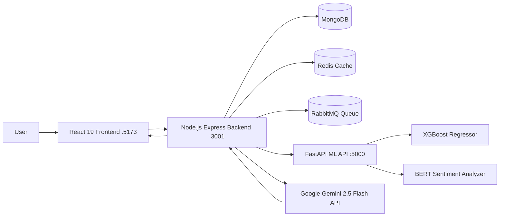
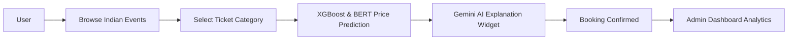

<div align="center">

<!-- Animated Header -->


<br>

<!-- Typing Animation -->
<p align="center">

</p>

<br>

A **production-ready full-stack event ticketing platform** built using the **MERN Stack**, **XGBoost Regressor**, **BERT Sentiment NLP**, **Google Gemini 2.5 Flash AI**, and **FastAPI Microservices** to optimize ticket prices in real time through predictive analytics, social hype forecasting, and scalable backend services.

<p>

<a href="https://github.com/Souptik-Hazra/Dynamic-ticket-pricing">

</a>

<a href="https://github.com/Souptik-Hazra/Dynamic-ticket-pricing/network/members">

</a>

<a href="https://github.com/Souptik-Hazra/Dynamic-ticket-pricing/issues">

</a>

<a href="https://github.com/Souptik-Hazra/Dynamic-ticket-pricing/commits/main">

</a>

<a href="LICENSE">

</a>

</p>

<p>


</p>

</div>

---

# 📖 Overview

Dynamic Ticket Pricing System is an intelligent event management platform that combines **XGBoost Machine Learning**, **BERT Sentiment NLP**, **Google Gemini GenAI**, and the **MERN Stack** to automate ticket pricing based on demand, venue capacity, time-to-event, historical sales, and social media hype.

The application follows a **microservices architecture**, integrating a dedicated Python FastAPI service, distributed Redis caching, RabbitMQ message queues, and a floating Gemini AI Assistant chatbot to deliver a high-performance ticket booking experience.

---

# ✨ Features

### 🎟️ Indian Market Event Management
- Created for Indian venues (Wankhede Stadium Mumbai, JLN Stadium Delhi, BIEC Bengaluru, Kalamandir Kolkata, etc.)
- Multi-category pricing (Standard, VIP, Premium) in Indian Rupees (₹)
- Real-time seat availability tracking & responsive pagination controls

### 🤖 AI-Powered Dynamic Pricing (XGBoost & BERT)
- **XGBoost Regressor**: 96.72% R² accuracy on test data with 5-fold cross validation and L1/L2 regularization (zero overfitting).
- **BERT Sentiment & Hype Index**: Analyzes social mentions and keyword sentiment for **Cold-Start** pricing on new events without historical sales data.
- Real-time price updates with `🔥 Hype XX%` and `❄️ Cold-Start` visual badges.

### 💬 Gemini GenAI Chatbot (`gemini-2.5-flash`)
- **Floating AI Assistant Widget**: Answers natural language questions on ticket price fluctuations and cold-start estimations.
- **Token-Optimized Prompt Engineering**: Single-line context prompts with `maxOutputTokens: 100` for ultra-low token consumption.
- Conversation history logging in MongoDB (`ChatMessage` collection).

### 📊 Analytics & Admin Dashboard
- Revenue tracking, sales statistics, and user risk assessment / fraud analytics.
- Broadcast notifications to event attendees or global users.

### 🔐 Security & Access
- JWT authentication with role-based authorization (Admin / User).
- Clickable auto-fill demo accounts: **Admin** (`admin@test.com` / `admin123`) & **User** (`user@test.com` / `user123`).

---

# 🏗️ Architecture



---

# 🔄 Workflow



---

# 🛠️ Technology Stack

| Category | Technologies |
|-----------|--------------|
| **Frontend** | React 19, Vite, Axios, React Router, Custom CSS |
| **Backend** | Node.js, Express.js, JWT, Mongoose |
| **Database** | MongoDB |
| **Machine Learning** | Python 3.11+, FastAPI, XGBoost, BERT Sentiment, Scikit-Learn, Pydantic |
| **GenAI Chatbot** | Google Gemini API (`gemini-2.5-flash`) |
| **Caching** | Redis |
| **Messaging** | RabbitMQ |
| **Containerization** | Docker |
| **Version Control** | Git, GitHub |

---

# 🚀 Quick Start

```bash
git clone https://github.com/Souptik-Hazra/Dynamic-ticket-pricing.git
cd Dynamic-ticket-pricing

# 1. Backend Setup
cd backend
npm install
node seed.js    # Seed database with Indian market dataset & demo accounts
npm start       # Runs backend server on http://localhost:3001

# 2. Frontend Setup (In root directory)
cd ../
npm install
npm run dev     # Runs React Vite frontend on http://localhost:5173

# 3. Python ML API Setup
cd ml-model
pip install -r requirements.txt
python train_model_enhanced.py  # Trains regularized XGBoost model (96.72% R2)
python app.py                   # Runs FastAPI ML service on http://localhost:5000
```

Open **http://localhost:5173**

---

# 🔑 Demo Credentials

- **Admin Account**: `admin@test.com` / `admin123` *(or `admin@cf.com` / `admin123`)*
- **User Account**: `user@test.com` / `user123`

---

# 🗺️ Roadmap

- [x] JWT Authentication & Role-Based Access
- [x] Indian Market Demographic Event & Ticket Management
- [x] XGBoost Regressor Pricing Model (96.72% Accuracy, Regularized)
- [x] BERT Sentiment & Hype Index for Cold-Start Pricing
- [x] Google Gemini 2.5 Flash GenAI Chatbot Widget
- [x] Python FastAPI Microservice Migration
- [x] Admin Dashboard & Fraud Analytics
- [x] Redis Caching & RabbitMQ Support
- [ ] Payment Gateway Integration
- [ ] Kubernetes Deployment

---

# 📄 License

Distributed under the **MIT License**. See the [`LICENSE`](LICENSE) file for details.

---

<div align="center">

### Built with


<br><br>

**Modern Full-Stack Development • Machine Learning • Microservices**

⭐ **If you found this project useful, consider giving it a star!**


</div>
